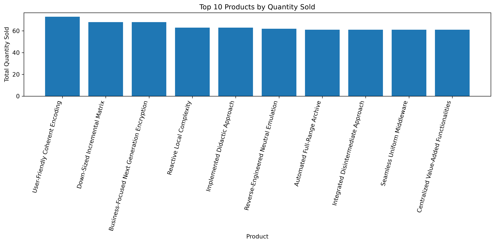
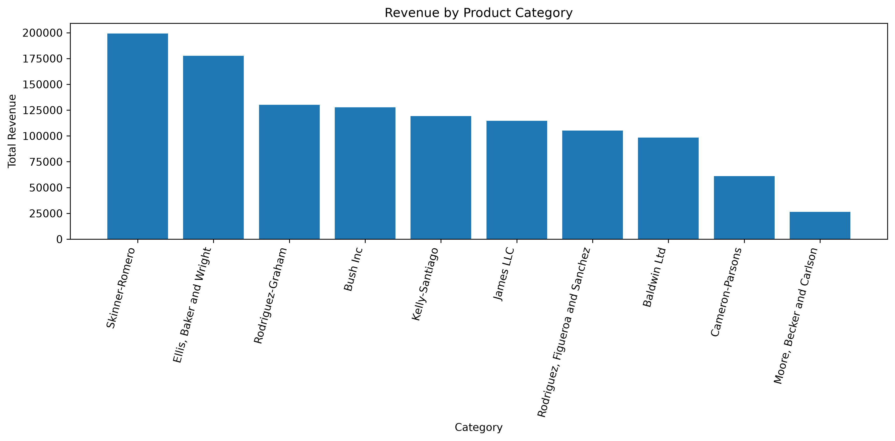
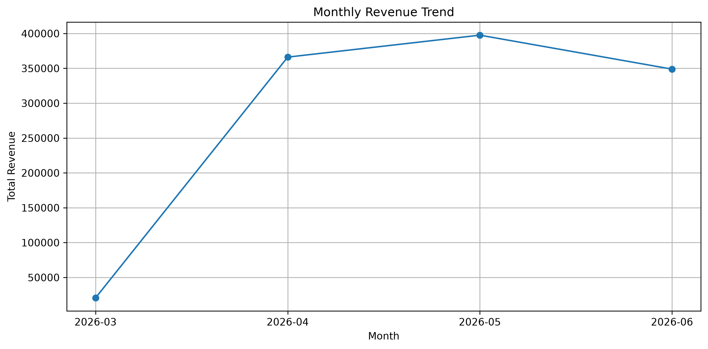
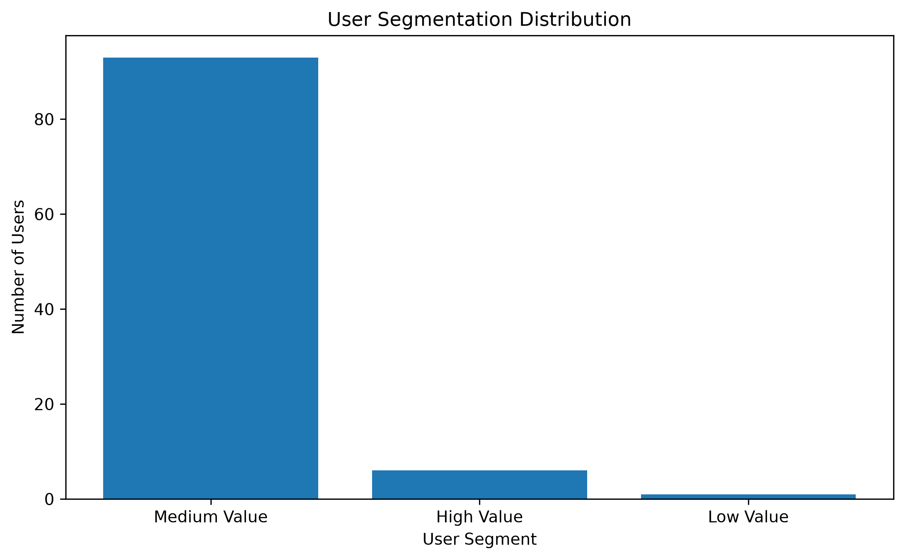

# Distributed Multi-Model Analytics for E-commerce Data Report

**Prepared by:** MANZI Emmanuel
**Project:** AUCA Final Project — Big Data Analytics
**Repository:** https://github.com/MANZIEmmy/bigdata-ecommerce-analytics

---

## 1. Executive Summary

This project implements a distributed multi-model analytics pipeline for synthetic e-commerce data. The main goal was to demonstrate how different big data technologies can be used together to store, process, analyze, and visualize e-commerce datasets. The project uses MongoDB for document-based storage and aggregation, HBase for wide-column session storage, and Apache Spark for batch analytics and Spark SQL.

The dataset represents an e-commerce platform with users, products, categories, transactions, and browsing sessions. During development, a reduced dataset was used to allow fast testing and validation on a local Windows 10 Docker environment. The original provided dataset configuration supports a much larger scale, but the reduced configuration allowed the full pipeline to be implemented and verified successfully.

The project successfully completed data generation, MongoDB loading and aggregation, HBase table design and session loading, Spark analytics, Spark SQL queries, CSV output generation, static visualizations, technical documentation, screenshot evidence, and GitHub deployment.

---

## 2. Project Objective

The objective of this project was to build a distributed analytics solution for e-commerce data using multiple storage and processing technologies. The project required the use of:

* MongoDB for document-oriented data modeling and analytics.
* HBase for distributed session data storage.
* Apache Spark for batch processing, data cleaning, analytical processing, and SQL-based analysis.
* Python for data loading, transformation, visualization, and automation.
* Docker Compose for managing the required services.

The final solution was expected to demonstrate how different data storage models can support different analytical needs in an e-commerce environment.

---

## 3. System Architecture

The system was designed using a multi-model architecture. Each technology was selected based on the type of data and access pattern it supports best.

### 3.1 Architecture Overview

```text
Dataset Generator
        |
        v
Generated JSON Files
        |
        +--------------------+
        |                    |
        v                    v
     MongoDB              HBase
 Document Store       Wide-Column Store
        |                    |
        +---------+----------+
                  |
                  v
            Apache Spark
       Batch Analytics + Spark SQL
                  |
                  v
        CSV Outputs + Visualizations
```

### 3.2 Technology Roles

| Technology     | Role in the Project                                                                                               |
| -------------- | ----------------------------------------------------------------------------------------------------------------- |
| MongoDB        | Stores users, products, categories, transactions, and sessions as document collections                            |
| HBase          | Stores user session data using a row-key strategy optimized for user-session lookup                               |
| Apache Spark   | Performs batch analytics, data cleaning, normalization, product affinity analysis, cohort analysis, and Spark SQL |
| Python         | Supports data loading, HBase loading, Spark scripts, and visualization generation                                 |
| Docker Compose | Runs MongoDB, HBase, Spark master, and Spark worker services                                                      |

### 3.3 Docker Services

The project used Docker Compose to run the following services:

| Service      | Docker Image         | Purpose                              |
| ------------ | -------------------- | ------------------------------------ |
| MongoDB      | `mongo:7`            | Document database                    |
| Spark        | `apache/spark:3.5.3` | Spark master and analytics execution |
| Spark Worker | `apache/spark:3.5.3` | Spark worker node                    |
| HBase        | `dajobe/hbase`       | Wide-column storage for session data |

Evidence of running services was captured in:

```text
screenshots/docker_services.png
```

---

## 4. Dataset Configuration

The original dataset generator supports a large-scale dataset. However, for local development, a reduced dataset was used.

### 4.1 Original Provided Configuration

```python
NUM_USERS = 10000
NUM_PRODUCTS = 5000
NUM_CATEGORIES = 25
NUM_TRANSACTIONS = 500000
NUM_SESSIONS = 2000000
TIMESPAN_DAYS = 90
```

### 4.2 Development Configuration Used

```python
NUM_USERS = 100
NUM_PRODUCTS = 100
NUM_CATEGORIES = 10
NUM_TRANSACTIONS = 1000
NUM_SESSIONS = 5000
TIMESPAN_DAYS = 90
```

The reduced configuration was used to allow faster execution on a local Windows 10 Docker environment. The same pipeline design can be applied to the original full dataset configuration if more computing resources are available.

### 4.3 Generated Files

The generated files were stored in the `data/` folder:

```text
data/users.json
data/categories.json
data/products.json
data/transactions.json
data/sessions_0.json
```

---

## 5. MongoDB Implementation

MongoDB was used as the document-oriented database for storing the main e-commerce entities. It was selected because the generated data contains nested and semi-structured fields such as transaction items, product price history, user geographic information, and browsing session details.

### 5.1 Database and Collections

The database name used was:

```text
ecommerce
```

The collections created were:

```text
users
categories
products
transactions
sessions
```

### 5.2 Imported Data Counts

| Collection   | Documents Imported |
| ------------ | -----------------: |
| users        |                100 |
| categories   |                 10 |
| products     |                100 |
| transactions |               1000 |
| sessions     |               5000 |

Evidence of MongoDB counts was captured in:

```text
screenshots/mongodb_counts.png
```

### 5.3 MongoDB Aggregations

Three main MongoDB aggregations were implemented.

#### Product Popularity

This aggregation identified the most frequently purchased products by unwinding the transaction `items` array and grouping by product ID.

#### Revenue by Category

This aggregation joined transactions with products and categories to calculate total revenue and quantity sold per category.

#### User Segmentation

This aggregation grouped users by transaction count and total spending. Users were classified into value segments:

| Segment      | Rule                      |
| ------------ | ------------------------- |
| High Value   | More than 15 transactions |
| Medium Value | 5 to 15 transactions      |
| Low Value    | Fewer than 5 transactions |

### 5.4 MongoDB Indexes

The following indexes were created:

```javascript
db.transactions.createIndex({ user_id: 1 })
db.transactions.createIndex({ "items.product_id": 1 })
db.products.createIndex({ product_id: 1 })
db.products.createIndex({ category_id: 1 })
db.categories.createIndex({ category_id: 1 })
db.sessions.createIndex({ user_id: 1 })
```

These indexes improve query performance for user-level analysis, product popularity analysis, category joins, and session lookup.

---

## 6. HBase Implementation

HBase was used to store user session data. Session data is suitable for HBase because it is high-volume, semi-structured, and time-oriented. In an e-commerce system, sessions can grow quickly because each browsing activity, page view, cart event, and conversion action may generate session-level records.

### 6.1 HBase Table

The table created was:

```text
user_sessions
```

### 6.2 Column Families

The table used four column families:

| Column Family | Purpose                                                        |
| ------------- | -------------------------------------------------------------- |
| `info`        | Stores user ID, session ID, start time, end time, and duration |
| `device`      | Stores device type, operating system, and browser              |
| `activity`    | Stores viewed products, page views, and conversion status      |
| `cart`        | Stores cart contents                                           |

### 6.3 Row Key Design

The HBase row key format was:

```text
user_id#start_time#session_id
```

Example:

```text
user_000068#2026-04-05T02:38:08#sess_fd011b4e68
```

This design was chosen because:

| Row Key Part | Reason                                                |
| ------------ | ----------------------------------------------------- |
| `user_id`    | Enables retrieval of all sessions for a specific user |
| `start_time` | Preserves chronological session order                 |
| `session_id` | Ensures uniqueness                                    |

### 6.4 HBase Loading and Verification

A Python script was created to load session data:

```text
scripts/load_sessions_to_hbase.py
```

During development, 100 sessions were loaded into HBase. One manual test row had also been inserted, giving a total of 101 rows.

Verification command:

```ruby
count 'user_sessions'
```

Result:

```text
101 row(s)
```

Evidence was captured in:

```text
screenshots/hbase_count.png
```

### 6.5 User Session Query

To test the row key strategy, a prefix scan was performed:

```ruby
scan 'user_sessions', {
  FILTER => "PrefixFilter('user_000068')"
}
```

This returned:

```text
3 row(s)
```

This confirmed that the row-key design supports user-specific session retrieval. Evidence was captured in:

```text
screenshots/hbase_user_query.png
```

---

## 7. Apache Spark Implementation

Apache Spark was used for batch analytics and Spark SQL processing. Spark was selected because it can process large datasets, handle nested structures, perform transformations, and run SQL queries over distributed data.

### 7.1 Spark Environment

| Component                   | Version              |
| --------------------------- | -------------------- |
| Spark                       | 3.5.3                |
| Scala                       | 2.12.18              |
| Java inside Spark container | 11.0.24              |
| Docker image                | `apache/spark:3.5.3` |

### 7.2 Spark Folder Mounting

The project folder was mounted into the Spark container using Docker Compose:

```yaml
volumes:
  - .:/opt/spark/work-dir
working_dir: /opt/spark/work-dir
```

This allowed Spark to read files from:

```text
data/
scripts/
outputs/
reports/
```

### 7.3 Spark Validation

A validation script was created:

```text
scripts/spark_check.py
```

This script confirmed that Spark could read all generated JSON files using multiline JSON mode:

```python
spark.read.option("multiLine", "true").json(path)
```

Spark verified the following row counts:

| Dataset      | Rows |
| ------------ | ---: |
| users        |  100 |
| products     |  100 |
| categories   |   10 |
| transactions | 1000 |
| sessions     | 5000 |

---

## 8. Spark Analytics and Integration Layer

The main analytics script was:

```text
scripts/spark_analytics.py
```

The script performed data cleaning, normalization, joins, aggregations, product affinity analysis, cohort analysis, and Spark SQL monthly revenue analysis.

### 8.1 Data Cleaning and Normalization

The transactions dataset was cleaned by converting timestamp values into Spark timestamp and date columns.

```python
transactions_clean = transactions \
    .withColumn("transaction_ts", to_timestamp(col("timestamp"))) \
    .withColumn("transaction_date", to_date(col("transaction_ts")))
```

The transaction `items` array was normalized using `explode`, transforming nested transaction records into product-level line items.

### 8.2 Analytics Produced

| Analysis                        | Output File                                 |
| ------------------------------- | ------------------------------------------- |
| Top products                    | `outputs/final_csv/top_products.csv`        |
| Category revenue                | `outputs/final_csv/category_revenue.csv`    |
| User segmentation               | `outputs/final_csv/user_segments.csv`       |
| Product affinity                | `outputs/final_csv/product_affinity.csv`    |
| Cohort analysis                 | `outputs/final_csv/cohort_analysis.csv`     |
| Monthly revenue using Spark SQL | `outputs/final_csv/monthly_revenue_sql.csv` |

### 8.3 Product Affinity Analysis

Product affinity analysis identified products that were bought together in the same transaction. The analysis created product pairs and counted how many times each pair appeared together.

This supports e-commerce use cases such as:

* Recommendation systems.
* Cross-selling.
* Product bundling.
* Basket analysis.

### 8.4 Cohort Analysis

Cohort analysis grouped users by registration month and transaction month. This helped analyze user activity and revenue across time.

### 8.5 Spark SQL Monthly Revenue

Spark SQL was used to calculate monthly revenue, transaction count, and average transaction value.

```sql
SELECT
    date_format(transaction_ts, 'yyyy-MM') AS revenue_month,
    COUNT(DISTINCT transaction_id) AS transaction_count,
    ROUND(SUM(total), 2) AS total_revenue,
    ROUND(AVG(total), 2) AS average_transaction_value
FROM transactions
GROUP BY date_format(transaction_ts, 'yyyy-MM')
ORDER BY revenue_month
```

Spark analytics completed successfully and evidence was captured in:

```text
screenshots/spark_analytics_success.png
```

---

## 9. Analytical Results

### 9.1 Top Products

The top product by quantity sold was:

```text
User-Friendly Coherent Encoding
```

with:

```text
73 units sold
```

Other high-performing products included:

* Down-Sized Incremental Matrix
* Business-Focused Next Generation Encryption
* Reactive Local Complexity
* Implemented Didactic Approach

### 9.2 Revenue by Category

The highest revenue category was:

```text
Skinner-Romero
```

with total revenue of:

```text
199220.53
```

Other high-revenue categories included:

* Ellis, Baker and Wright
* Rodriguez-Graham
* Bush Inc
* Kelly-Santiago

### 9.3 User Segmentation

The highest-spending user was:

```text
user_000097
```

with:

```text
19 transactions
25030.89 total spent
```

The segmentation output identified high-value, medium-value, and low-value customers based on transaction frequency.

### 9.4 Monthly Revenue

Spark SQL produced the following monthly revenue summary:

| Month   | Transactions |   Revenue | Average Transaction Value |
| ------- | -----------: | --------: | ------------------------: |
| 2026-03 |           21 |  20703.88 |                    985.90 |
| 2026-04 |          317 | 366126.63 |                   1154.97 |
| 2026-05 |          341 | 397608.12 |                   1166.01 |
| 2026-06 |          321 | 348883.54 |                   1086.86 |

The highest revenue month was May 2026.

---

## 10. Visualizations

Four static visualizations were generated using Pandas and Matplotlib.

The visualization script was:

```text
scripts/generate_visualizations.py
```

The generated visualizations were:

```text
outputs/visualizations/top_products_by_quantity.png
outputs/visualizations/category_revenue.png
outputs/visualizations/monthly_revenue_trend.png
outputs/visualizations/user_segmentation_distribution.png
```

Evidence of visualization files was captured in:

```text
screenshots/visualizations_files.png
```

### 10.1 Visualization Purposes

| Visualization                  | Purpose                                        |
| ------------------------------ | ---------------------------------------------- |
| Top products by quantity sold  | Shows most popular products                    |
| Revenue by category            | Compares revenue performance across categories |
| Monthly revenue trend          | Shows revenue movement over time               |
| User segmentation distribution | Shows customer distribution by value segment   |

### 10.2 Visualization Images









---

## 11. Project Repository and Structure

The completed project was pushed to GitHub:

```text
https://github.com/MANZIEmmy/bigdata-ecommerce-analytics
```

The main project structure includes:

```text
data/
docs/
outputs/
reports/
screenshots/
scripts/
README.md
dataset_generator.ipynb
docker-compose.yml
requirements.txt
.gitignore
```

Evidence of project structure was captured in:

```text
screenshots/project_structure.png
```

---

## 12. Challenges and Solutions

### 12.1 Large Dataset Size

The original dataset configuration was large and could be slow to run on a local machine. A reduced development configuration was used to validate the full pipeline efficiently.

### 12.2 Git Bash Path Conversion

Git Bash converted Linux paths such as `/opt/spark/bin/spark-submit` into Windows paths. This was solved by using double slashes:

```bash
docker exec spark //opt/spark/bin/spark-submit scripts/spark_analytics.py
```

### 12.3 Spark CSV Output Structure

Spark writes CSV output as folders containing partition files. This was solved by copying the final `part-*.csv` files into a clean folder:

```text
outputs/final_csv/
```

### 12.4 GitHub Authentication

GitHub rejected normal password authentication for Git operations. This was solved using a GitHub Personal Access Token with repository permissions.

---

## 13. Limitations

The project was fully implemented and validated using a reduced development dataset. The original full-scale dataset would require more processing time, memory, and storage.

The HBase loading script used HBase shell `put` commands, which are suitable for development but not ideal for production-scale ingestion. For full-scale loading, Spark-to-HBase integration or HBase bulk loading would be more appropriate.

Spark analytics were performed on the generated JSON files mounted into the Spark container. The storage systems and analytics layer share common generated data and IDs, but a production deployment could add direct Spark connectors to MongoDB and HBase for tighter system integration.

---

## 14. Conclusion

This project successfully implemented a distributed multi-model analytics pipeline for e-commerce data. MongoDB was used for document storage and aggregation, HBase was used for wide-column session storage and user-session lookup, and Apache Spark was used for batch analytics, Spark SQL, product affinity analysis, cohort analysis, and output generation.

The project produced clean CSV outputs, static visualizations, technical documentation, screenshot evidence, and a GitHub repository. The final implementation demonstrates how multiple big data technologies can work together to support analytical use cases in an e-commerce environment.

---

## 15. References

* Apache Spark documentation
* MongoDB documentation
* Apache HBase documentation
* GitHub documentation
* Project dataset generator notebook
